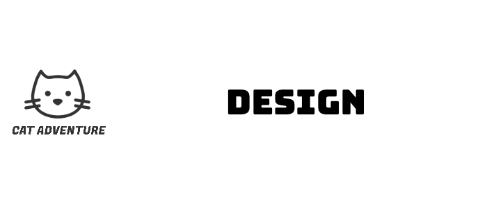

  

## Table of Contents
  - [Behavioral Diagram](#behavioral-diagram)
  - [System architecture](#system-architecture)
  - [Class diagrams](#class-diagrams)
  - [Visual Design Resources](#Visual-Design-Resources)

 ## Behavioral Diagram
The sequence diagram below describes in order how actions in the game are performed.

Firstly the user interacts with a series of menus, selecting a character, difficulty level and entering a username. Once the game begins the player jumps over a series of randomly generated obstacles, the generation of each obstacle is one iteration in the Obstacle Loop.

Once the player has cleared a number of obstacles without any collisions, they break out into the Boss Iteration loop and the boss character appears, moving side to side on the screen. If the player defeats the boss by landing on the head of the boss, they re-enter the obstacle loop but the speed of the game increases slightly.

If the player clears the next set of randomly generated obstacles, they face the boss again in the Boss Iteration loop but now the boss is jumping left to right on the screen. As the Boss Iteration loop increments, the movement of the boss becomes more exaggerated and erratic and harder to defeat, until the player dies.

When the player dies, they can restart the game or quit. If the player decides to quit they are stuck in the “fake quit scenario” loop for three iterations, the game begins again after the first three times they attempt to quit the game.

## System architecture

The "Cat Adventure" game employs a custom, object-oriented system architecture that emphasises modularity and separation of concerns. This approach enables the efficient organisation and management of various components and functionalities within the game. The architecture is organised hierarchically, with a central class orchestrating the game's state and managing interactions between other classes.

The object-oriented design principles followed in this architecture allow for the creation of abstract parent classes, which provide shared functionality for their child classes. This promotes code reuse and simplifies the implementation of specific behaviours and logic in the child classes. The communication between classes ensures smooth gameplay and responsiveness to user input, while also enabling the possibility of future enhancements and maintenance with ease.

## Class diagrams

When designing our system architecture, we took the approach that it would be better to have a higher number of discrete classes, each responsible for doing a specific function well, rather than having a smaller number of classes, each performing for lots of tasks.

[<b>NyanCat Class</b>](https://github.com/UoB-COMSM0110/2023-group-4/blob/main/Code/Game/nyanCat.pde) - This is the main class which handles the game states, the in-game play collision detection and keeps track of the score. It is the highest level class and renders all visible objects in the game.

[<b>Button Class</b>](https://github.com/UoB-COMSM0110/2023-group-4/blob/main/Code/Game/Button.pde) - The Button class handles the rendering of all selectable buttons in the game. It features functions for updating the button's status, rendering the button with either an image, animation, or text, and detecting if the button has been clicked. Additionally, the class provides methods for accessing the button's width, height, position, and image file path.

[<b>PEObject Class</b>](https://github.com/UoB-COMSM0110/2023-group-4/blob/main/Code/Game/PEObject.pde) - The player enemy object class is an abstract parent class of the player and enemy classes. It provides functionality for the dynamic, moving objects in the games, and it has a generalisation relationship with the Player and Enemy classes.

[<b>Player Class</b>](https://github.com/UoB-COMSM0110/2023-group-4/blob/main/Code/Game/Player.pde) - The Player class is a child class of the PEObject class, which handles the movement of the player character. It includes variables and methods to manage collisions with other objects in the game, as well as animation files and display functions for rendering the player character on screen.

[<b>Enemy Class</b>](https://github.com/UoB-COMSM0110/2023-group-4/blob/main/Code/Game/Enemy.pde) - The Enemy class is responsible for handling the movement and behaviour of the game's enemies. It is a child class of the PEObject class, which provides common functionality for dynamic, moving objects in the game. The Enemy class also includes methods for setting the enemy's velocity and behaviour based on the game's difficulty level.

[<b>Object Class</b>](https://github.com/UoB-COMSM0110/2023-group-4/blob/main/Code/Game/Object.pde) - The object class is an abstract parent class of the static game objects, the obstacles and the cloud objects, which are not interacted with. It has a generalisation relationship with the Obstacle and Cloud classes.

[<b>Obstacle Class</b>](https://github.com/UoB-COMSM0110/2023-group-4/blob/main/Code/Game/Obstacle.pde) - The Obstacle class is a child class of the Object class that displays and updates the obstacles in the game by changing their positions horizontally. The class is initialised with the obstacle's properties such as its x and y position, width and height, velocityX and its image.

[<b>Cloud Class</b>](https://github.com/UoB-COMSM0110/2023-group-4/blob/main/Code/Game/Cloud.pde) - a child of the Object class that handles rendering the background clouds in the game. It also implements the necessary methods for updating and moving the clouds on the screen.

## Visual Design Resources:
Sketches outlining the visual layout for the game menus, in game play,  fake quit scenario and leaderboard can be found here:
[Game Visual Sketches](https://github.com/UoB-COMSM0110/2023-group-4/blob/main/Diagrams/classDiagram/ClassDiagram.jpeg)

Note the obstacles in these sketches are represented as pipes as at this point but are to be replaced with the following designs:
[Obstacle Designs](https://github.com/UoB-COMSM0110/2023-group-4/tree/main/Code/design_and_interface/game_BG/obstacle)
