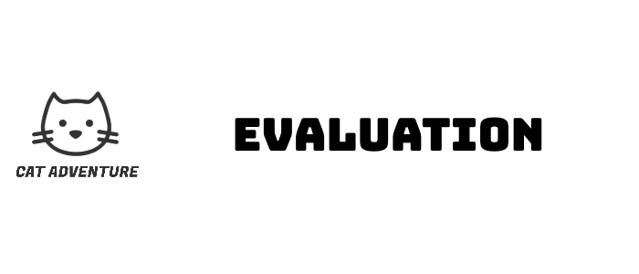

  

## Table of Contents
- [Qualitative Evaluation](#qualitative-evaluation)
- [Quantitative Evaluation](#quantitative-evaluation)
- [Code Testing](#cold-testing)

## Qualitative Evaluation
### Heuristic Evaluation
The first evaluation of our game was an analytical heuristic evaluation, we chose three external game development experts to carry out the evaluation to see if we were breaking any of the 10 heuristic rules. The results of this evaluation can be seen in the table below:
 

 
 
To understand the feedback provided, below are screenshots of the relevant scenes of our game at the time of evaluation. At this point, our game included basic functions such as character selection and jumping over simple obstacles. We did not consider the game to be a finished product but knew that the evaluation would provide useful feedback for completing the rest of the game features.
 

  

 
 

We found the first heuristic evaluation to be very useful as it highlighted problems which we could not immediately see as the developers of our own game. Below are strategies for solving the four highlighted issues:

**Issues 1 & 3 - Choosing characters** 
We decided that we needed to make the way we displayed the selected character more obvious, and probably some explanatory text to guide the user through choosing a character. This required some redesign of the start page. Making this change would add a lot of value to our game because currently most users did not know they could play as different characters.

**Issue 2 - Control the game** 
Could easily be overcome by adding some instructions on how to move the character before the game begins.

**Issue 4 - Game Interface** 
This issue could also be resolved with some explanatory text before the game starts, however it conflicts with our twist of the “Fake Quit Scenario” so this issue would need more careful consideration and further evaluation.

## Think Aloud Evaluation

Second iteration of qualitative evaluation was a “talk aloud” evaluation. We found four students with no experience in game development to perform our evaluation.

**Questions to be answered during the evaluation:**
- Is it clear the users should choose a character before playing?
- Is it clear how to play the game once it starts?
- Is the game enjoyable?

**The task:** play the game until the game ends.

Key points taken by the two observers of the the evaluation are categorised below:

**Game Aesthetic:**
>Menu design is nice, good aesthetic

>Character selection is fun (all participants chose a character)

>Text in the top left is distracting (position coordinates)

**Game Dynamics**
>It's quite fast paced to begin with but you soon get used to it

>It’s not obvious you have the ability to move left and right

>Fake quit scenario is harsh but funny

**Suggested Features**
>How do you actually quit?

**Potential Bugs**
>The collision detection with obstacles is sometimes a bit harsh/inaccurate.

>If a player navigates to the top right corner and jumps continuously, the player hovers and would never die – is this supposed to happen?

To understand the feedback provided, below are screenshots of the relevant scenes of our game at the time of this evaluation.
 

     
    
 
 
 
 
 

 

## Quantitative Evaluation
### System Usability Scale Evaluations

We asked 10 users to play our game on both difficulty levels and complete an SUS form after each. 
Results show below:

 

    

 

    

 
 

For both SUS evaluations the results were promising. Both results were significantly over the average of 68, meaning users find our game easy to use.

**Wilcoxon Signed Rank Test Results**

W test statistic = 0
 
 
Number of non-tied pairs (n) = 5
 
 
From a visual inspection of the data, one would say there is no there is no significant difference in the usability of the game when played on the normal difficulty mode compared to when played on the hard difficulty mode.
 
 
From the Wicoxon signed rank test, a calculated W value of 0 for a sample size of 10, implies there is a significant difference between the two two sets of results. However, because 5 pairs in our evaluation had no difference at all between the two difficulty levels, the number of non-tied pairs (number of pairs which actually affect the outcome of the calculation) is only 5. 
The [critical values table](/Diagrams/WilcoxonTable/CtiticalValuesTable.png)shows that a significant difference cannot be achieved with an n value of 5 - hence the Wilcoxon signed rank test does not work for this data set. 
 
 
[This report](http://users.sussex.ac.uk/~grahamh/RM1web/WilcoxonHandoout2011.pdf)walks through the  issue we faced when doing the Wilcoxon Signed Rank calculator on our data.
 
 
There was deemed to be no difference in usability when our game is played on different difficulty modes. We suggest that this is a good thing, on the harder difficulty setting the game is faster. This requires more skill, but was not designed to be more difficult in terms of useability.

## Code Testing
