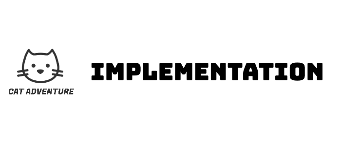

<p align="center">
  
</p>


## Table of Contents
- [Skeleton Model](#skeleton-model)
- [Three main challenges](#Three-main-challenges)
- [Challenge 1](#challenge-1)
- [Challenge 2](#challenge-2)
- [Challenge 3](#challenge-3)
- [Task Strategy](#task-strategy)


## Skeleton Model

Early on in the implementation phase, our lead developer produced a skeleton model of our game. This included three game states:
- Start (including a start menu)
- In play state (including mechanics of a character jumping over simple blocks)
- Game Over (including a game over menu)

After some refactoring, parameterisation and code documentation (in the form of comments in the code), our lead developer explained the code to the rest of the team. From this exercise, the rest of the team learned how to use and update the game parameters, incorporate more design features, and adapt the movements of the character and the obstacles. This allowed other developers to enhance the user experience of the game, stylising menus, obstacles, and characters, and adding more features, such as player score and character selection concurrently. Before making any updates, we first made sure that everyone was up to date with the Git strategy: first making changes on a branch and then merging the updates back to main when a Kanban task was completed.

At this point we did our first qualitative evaluation.

## Three main challenges

During the game design phase we had identified that the three main challenges of our game were going to be:

1. Creating animations for the characters

2. Creating the fake quit scenario which was an important part of our design

3. Creating the global leader board which remembered the high scoring players every time the program is restarted

Once we had our concept, we focused on how to implement the game; collaboratively as a team. The first step of the implementation phase was compiling research around game design on the Processing platform. This involved completing the processing challenges set for us to do from the tutorials, each team member completed a different challenge to develop everyone's understanding of the Processing language. We also all familiarised ourselves with the Processing documentation online.

## Challenge 1
The online Processing documentation provided us with a solution to our initial challenge of creating animations for our game characters. This challenge was one of the first implementation tasks outlined on our Kanban board. By adapting example code from the documentation, we were able to transform a series of images into animations for the characters in our game.


<p align="center">
  
</p>

```java
//code to loop the images
int numFrames = 6;
int curFrame = 0;
PImage[] imgs = new PImage[numFrames];
PGraphics gif;

void setup() {
  size(270, 170);
  gif = createGraphics(width, height);
  frameRate(24);

  for (int i=0; i<numFrames; i++) {
    imgs[i] = loadImage("Images/Nyan_Original/frame_" + i + ".tiff");
  }

  loop();
}
```

Our approach involved finding GIFs online that we wanted to use as characters, exporting them to .tiff images frame by frame, and removing the background of each frame. In the code, we simply looped through the image frames to create the appearance of animation. The key was to preserve the transparent background of the images while ensuring that the previously displayed image in Processing was removed before rendering the next animation frame.

<p align="center">

</p>

We continued to find and learn from online resources, such as Possessing games that shared similar concepts to ours, already published on Git. These resources were very useful for understanding how to implement the game mechanics for jumping, detecting obstacle collisions, and introducing the boss character which would move around on the screen.


## Challenge 2

The second challenge we were able to resolve was the challenge of the fake quit scenario. The fake-quit scenario was part of our game concept. The first three times the player lost the game and decided to quit rather than play again, the player would be sent back to the start of the game. This challenge was about manipulating the states of the game. Since we had a solid implementation of the different game states from our skeleton model it was fairly straightforward to implement. It involved introducing a counter variable that incremented every time the user selected the “quit” option rather than the “play again” option. If the counter was less than 3,  an alternate pop-up screen was displayed (shown below left) declaring that you must play again, and the game restarted from the beginning.

<p align="center">
  
</p>

## Challenge 3
The third challenge of implementing the global leaderboard was the largest of the three challenges and the one we tackled last.
The first aspect of this challenge was creating an input text box for entering a username to be saved alongside each high score. After some research, we decided to use the ControlP5 import to implement the username text field on the character selection menu page. In the interest of the “visibility of system status” heuristic we also redesigned the character selection menu page to include instructions about how to enter a username and start the game.
See ordered screenshots of menu re-design below:

<p align="center">
  <br>
  <br>
  <br>
</p>


The second aspect of this challenge was reading and writing to a file so the high score records were persistent and remembered after closing and re-opening the program. We used the Java  NIO import to implement the dataflow between the external text file and the Leaderboard class, manipulating table object methods to store the data.

<p align="center">
  
</p>


Below is a snippet of some methods in the Leadboard class:

```java
Leaderboard(int maxEntries) {
  this.maxEntries = maxEntries;
  scores = new ArrayList<ScoreEntry>();
  loadFromFile(DEFAULT_FILENAME); // Load the entries from the file when initializing the leaderboard
}

  void loadFromFile(String filename) {
  String[] lines = loadStrings(filename);

  if (lines != null) {
    scores.clear();

    for (String line : lines) {
      String[] parts = line.split(",");

      if (parts.length == 2) {
        String name = parts[0];
        int score = Integer.parseInt(parts[1]);
        addScore(name, score);
      }
    }
  }
}

  void saveToFile(String filename) {
  String[] lines = new String[scores.size()];

  for (int i = 0; i < scores.size(); i++) {
    ScoreEntry entry = scores.get(i);
    lines[i] = entry.name + "," + entry.score;
  }

  saveStrings(filename, lines);
}

```

Within the time constraints, we did not have time to implement a global leaderboard on the web, where all downloaded instances of the game could view the global results, this still remains for future game development. However, for now, we have implemented a leaderboard that is persistent for each download of the game.


## Task Strategy
Throughout the development process we took the approach of, initially, only implementing the minimum viable product for each task. This was intended as an agile methodology. We then refined features at the end of sprints based on the results of team discussion, user testing and evaluations. We found this to be a more efficient use of time as less time was spent rewriting code to update to new ideas and feedback. We used this process for the skeleton model, obstacle, boss, character selection and menus.
