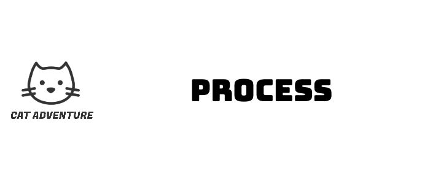

  

## Table of Contents
- [Git](#git)
- [The Kanban Board](#the-kanban-board)
- [Sprints](#sprints)
- [Team Meetings](#team-meetings)
- [Team Roles](#team-roles)
- [Reflection](#reflection)

## Git
One of the first things we did as a team was to organise our Git page and decide on a folder structure. Having an initial discussion about creating folders for code, videos, Diagrams , meeting minutes, research etc… which saved us time in the long run as it was clear to everyone where to upload their contributions, or where to find any materials on our git page.
Then we ensured everyone knew the basics of Git branches and the concept of merging to main so that it was possible to concurrently work on the project code and avoid any disasters like accidentally saving over someone else's work.
Early on in the project we did have some git problems. There were several merge conflicts we had to overcome in the beginning, we had to manually overcome some conflicts as some branches were not merged for a long time and were much further ahead than main. We learnt from these initial mistakes and from then on would check out a branch for every assigned task and merged to main more regularly. We also would checkout new branches for bug 
fixing later on in the process.

## The Kanban Board
The Kanban board was the most useful tool we used as a team. We created a Kanban board on the web application Trello and added all the team members early on in the project. The main uses of the Kanban board became apparent during the implementation stage of the project, when the bulk of the coding was being done. The majority of tasks were set during meetings, but individuals were also allowed to assign tasks to themselves/others as and when necessary. On top of being an organisational tool, it was also a good source of motivation for the team. As members moved their assigned tasks around from “Backlog” all the way through to “Done”. 
[link to kanban board images]

## Sprints
Our sprints were two weeks long. We chose a sprint length of two weeks as we were not working full time on this project due to other work commitments. At the beginning of each sprint we would assign Kanban tasks. We practised the playing poker method to estimate the time and effort each task, based on the collective knowledge of the team. After several weeks we had a rough idea of our team velocity (around 10 tasks per sprint). Having an idea of our team velocity was useful for determining how many of the features of our game we would have time to implement. We considered factors external to the project, knowing our team velocity would decrease during the April exam period and so we made allowances for this when assigning tasks during this period.

At the end of each sprint we would test the new features which had been implemented, each member of the team would play the game and report back any feedback and suggestions. This was a good form of regular testing and highlighted any new bugs. Bug fixing tasks were added to the tasks for the next sprint.

## Team Meetings
As a team we usually met every week to discuss the development of the game and assign tasks. We adopted several different approaches for team meetings. 

  

In the early phases of design we would meet as a whole team so everyone could contribute to the ideation process and ensure that we were all on the same page in terms of the fundamental game concepts.
As the development of the game was underway we took a more agile approach using the Scrum project management style. We conducted short 10 minute meetings after Software Engineering workshops where the Scrum Master proposed topics for discussion and we updated our Kanban board according to the newly completed/assigned tasks. During  the development phase we also met in sub groups to discuss details relevant to specific tasks and team members, based on the tasks assigned on the Kanban board. The subgroup meetings worked autonomously from the rest of the group, the team trusted the outcomes decided by the relevant team members.  
On Top of these meetings, on the day we formed our team we created a WhatsApp group as a means of informal communication. We use the group to arrange meetings, share spontaneous ideas, and ask day to day questions.
Team Roles
By the time we started the development phase of the project it was clear that everyone had assumed roles which suited their skills and interests. We thought it would be a good idea to formalise these positions for the duration of the project. Each team member played a crucial role in our project's success.

## Team Roles

**Lead Developer** - Ivan  
Ivan was responsible for developing the game's skeleton and details, ensuring a solid foundation for the gameplay.

**Front End Developer** - Mike  
Mike skillfully handled the interface design and overall look, creating an engaging and visually appealing experience for users.

**Back End Developer** - Marcin  
Marcin worked closely with Ivan to develop the game's back end, ensuring seamless functionality and performance.

**Creative Lead** - Antalya  
Antalya generated the game's core ideas and concepts, providing innovative designs that set our project apart.

**Administrator** - Kate  
Kate effectively managed the entire process, organizing meetings for regular updates and facilitating communication between team members.

By understanding and utilising the strengths of each team member, we were able to create a successful and enjoyable project, learning valuable lessons for future collaborations.

## Reflection
As a group, we worked well together. We were fortunate that we had a good mix of skills and interests, so everyone in the team got to work on what they enjoyed most. This fortune was also partly due to our agile working strategy and strong communication. Regular meetings played a crucial role in keeping the team aligned and focused on our goals. One of the reasons we worked so well as a team is because once we had a game concept, the lead developer implemented the framework of our minimum viable product, following the structure of our Class Diagram in a way which was easy to update and easy for others to understand. After this was achieved, it was straightforward for other developers to work simultaneously on the code, refining the mechanics of the game, updating the game aesthetics, and enhancing all things user experience related.