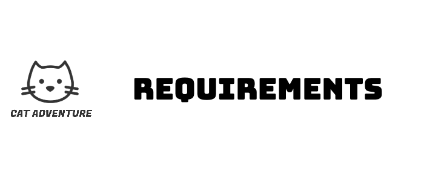

  

## Table of Contents
- [Early Stage Design](#early-stage-design)
- [Ideation Process](#ideation-process)
- [Paper Prototype](#paper-prototype)
- [Use Case Diagram](#use-case-diagram)
- [User Stories](#user-stories)

## Early Stage Design

Initially we had two main game concepts: 
- The [T-Rex](https://trex-runner.com/) jumping style platform game - featured on the Google Chrome browser.
- [Baba is you](https://hempuli.com/baba/) - a puzzle based top-down game. 

We each voted for our preferred game to develop, results shown below:

| Name         |  Game Preference Vote                |
|--------------|--------------------------------------|
| Antalya      |  T-Rex Game ft. Nyan Cat/flappy bird | 
| Kate Hunter  |  Baba is you                         |
| Marcin       |  T-Rex Game ft. Nyan Cat             |
| Mike         |  T-Rex Game ft. Nyan Cat/flappy bird | 
| Yuchen Zhang |  Baba is you / flappy bird           |

After discussing lots of questions and concepts surrounding both ideas, we unanimously decided on developing a jumping style game for several reasons: 

- Jumping games are fun, intuitive and easy for everyone to play.

- Designing many levels for a platform based game could be quite time consuming, in terms of creative and programming resources. A jumping game where the principle is similar throughout was deemed to be the more sensible choice.

- There were lots of initial thoughts on how to incorporate an interesting narrative for a jumping style game.

## Ideation Process
We started to question the game concept and wondered if it would be engaging enough for players to simply jump over a number of obstacles in order to gain a high score. After a quick brainstorming session we arrived at our twist, we would introduce a boss character, “Copy Cat”, Nyan-Cats nemesis who was the biggest obstacle of all. After clearing a certain number of obstacles Nyan-Cat would have to defeat the boss to progress further in the game.

As a result of brainstorming for a twist we actually came up with a second twist, the “fake quit scenario”. The player would not be able to quit the game easily when they died. This twist came with a tagline of “you cannot quit the game of life!”.

At this point we had a game concept with a quirky narrative, a main character and a twist. So we made a paper prototype.

## Paper Prototype

  <b>Click the image below to watch the video:</b> 
  

The paper prototype involved putting our ideas into practice and seeing how the game actually played. This stage was crucial in helping us identify any issues or areas for improvement, which we were then able to address and refine. Some design decisions we made after creating the paper prototype were:

To represent obstacles as representations of life's obstacles (bills, deadlines, wake up call etc..) and not confuse our game with the aesthetic of By [Super Mario](https://mario.nintendo.com/) world.

If the player successfully defeats the Copy Cat boss, they will be rewarded with celebratory messages. This provides the player with a goal to strive for, besides just aiming to achieve a high score.

We could incorporate the [Nyan Cat](https://play.google.com/store/apps/details?id=com.istomgames.engine&hl=en&gl=US&pli=1) theme tune playing on a loop during gameplay, which is a memorable feature associated with the Nyan Cat meme, further enhancing the overall gaming experience.

In conclusion, our ideation process was an iterative and collaborative effort that involved a series of discussions and refinements to arrive at our final concept. By considering various factors such as feasibility and player experience, we were able to create a game that we believe will be enjoyable and engaging for players

## Use Case Diagram

## User Stories
- As a player, I want to be able to select a character so that I can choose a different character to play as.
- As a player, I want to select a difficulty so that I can play as a level which suits my ability
- As a player, I want to see instructions so that I  know how to play the game.
- As a player, I want to jump over the obstacles so that I can get a higher score.
- As a player, I want to see a game over page when I die so that I know when I have lost the game.
- As a player, I want to be able to play again when the game is over so that I can try to get a higher score next time.
- As a player, I want to see an encouraging message when I lose the game so that I am encouraged to play again.
- As a game player, I want some gratification for completing a hard challenge so that I am encouraged to play more
- As a game player, I want to move forward and backward so that I can dodge obstacles.
- As a player I want to see my score on a leaderboard so that I can compare my achievement against other players

## Functional Requirements
- The system must have a start menu where the user can configure the game settings.
- The system must enable users to select a different character to play as by selecting with the mouse from several character options.
- The system must allow the user to enter a username by typing into a text box.
- The system must have two difficulty option buttons which vary the speed of the game and can be selected with a mouse.
- The system must provide clear written instructions explaining how to use the menu pages and play the game.
- The system must allow the player to move forwards, backwards and jump by using the left right and up arrows on the keyboard.
- The system must allow the user to defeat the boss by jumping on its head.
- The system must have a game over menu where the user can select quit or play again.
- The system must send the user to the beginning of the game the first three times they attempt to quit.
- The system must have user feedback when they defeat the boss with animation and sound effects.
- The system must implement a leaderboard.

